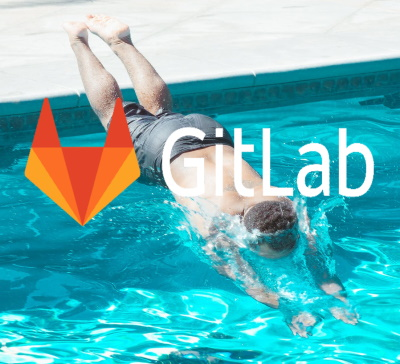
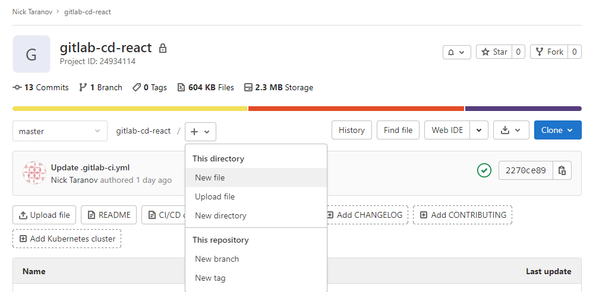

# Введение в непрерывную поставку (CD) при помощи GitLab

<center>



</center>

Данный туториал позволит вам быстро прочувствовать как происходит командная работа с использованием GitLab. В целом, начать практиковать DevOps/CD с GitLab проще чем с использованием других продуктов потому что GitLab - это решение "всё в одном".

В процессе этого туториала мы
- настроим базовое управления проектом на GitLab.com;
- создадим конвейер непрерывной поставки
- проведём несколько циклов работы с GitLab Flow
- изучим метрики CI/CD в GitLab

Желательны но необязательны базовые знания
- Git;
- Node.js;
- React;
- Docker;

Время от времени я буду просить вас что-то сделать. Такие моменты помечены значком 🛠️. Пожалуйста выполняйте действия по мере чтения текста чтобы получить от данного туториала наибольшую пользу.

>Трудно переводить на русский вещи, которые даже русскоязычные программисты между собой называют по-английски. Я постарался литературно переводить термины для которых есть общепринятые переводы и не переводить остальные. Например, мы будем использовать словечки вроде "чекбокс" и "коммитить", а названия разных штук в GitLab останутся на английском, как есть.

## 🏁 Введение и знакомство с проектом

В качестве "подопытного кролика" мы будем использовать чуть модифицированный шаблонный проект, созданный утилитой **create-react-app**.

>Почему React? Во-первых, это самая распространённая UI-библиотека на JavaScript, и многие читатели знакомы с ней. Во-вторых **create-react-app** даёт нам осмысленные стадии компиляции и тестирования которые уже реализованы за нас.

🛠️ Теперь давайте клонируем репозиторий с кодом с которым мы будем работать.

```
git clone https://github.com/ntaranov/gitlab-cd-react
```
🛠️ Перейдите в каталог локального репозитория
```
cd gitlab-cd-react
```
Должна отобразиться стандартная стартовая страница **create-react-app**.

> Вы можете вместо этого этапа просто создать новое приложение при помощи create-react-app, но версия в репозитории содержит некоторые правки, и версии пакетов в коде в репозитории я тестировал.

🛠️ Установите **npm** пакеты локально, выполнив
```bash
npm install
```
>Используйте `npm ci` если при выполнении `npm install` произойдёт ошибка 

🛠️ Попробуйте "собрать" проект
```bash
npm run build
```
Обратите внимание, что в папке `./build` появились соответствующие файлы, включая минифицированный JavaScript и CSS. 

🛠️ Затем запустите тесты
```bash
npm run test -- --coverage --watchAll=false --forceExit
```

🛠️ Осталось осуществить "развёртывание", но чтобы не засорять туториал инструкциями по установке веб-сервера, давайте просто запустим отладочный веб-сервер чтобы увидеть как выглядит наше веб приложение выглядит в браузере.
```bash
npm start
```

Если подумать, то осталось заменить последнюю инструкцию на копирование статических файлов из папки `./build` на веб-сервер - и развёртывание можно считать завершённым. В принципе, это вполне хватит для самостоятельной работы, однако для работы в команде в режиме непрерывной поставки может также захотеться иметь как минимум следующее:
- централизованный репозиторий с
  - управлением полномочиями членов команды;
  - code review;
- багтрекер чтобы 
  - планировать работу и 
  - отслеживать прогресс;
- среду сборки с
  - автоматическим запуском конвейера непрерывной поставки в нужные моменты;
  - визуализацией статуса сборки;
  - хранением артефактов;
  - автоматическим оповещением о ключевых событиях;
  - автоматическим развёртыванием в разные среды;
- сбор метрик непрерывной доставки.

Всё это, а также многое другое, поддерживается GitLab. [Платная версия](https://about.gitlab.com/pricing/) предлагает больше возможностей, но для наших целей нам хватит и бесплатной версии доступной на [GitLab.com](https://gitlab.com).

>GitLab выделяется на общем фоне отсутствием ограничений на использование собственных job runners, однако некоторые довольно базовые "управленческие" и "корпоративные" фичи GitLab вроде обязательного утверждения merge request'ов входят в платные версии. Проектам с открытым кодом все фичи GitLab доступны бесплатно. 

## ⚙️ Базовая настройка управления проектом на GitLab.com

В этой части мы создадим сам проект в GitLab и задачи над которыми будем работать в дальнейшем, а также настроим Kanban-доску для визуализации состояния проекта.

### 💼 Создание проекта в GitLab

Мы будем использовать GitLab.com в качестве инсталляции GitLab чтобы избежать хлопот по установке и настройке локальной версии. 

🛠️ Если у вас ещё нет учётной записи на GitLab.com, зайдите на `https://gitlab.com` и заведите её.

GitLab позволяет нам создать проект просто выполнив `push` в удалённый репозиторий.

🛠️ Воспользуемся для этого следующей командой:
```
git push https://gitlab.com/<user name>/gitlab-cd-react
```
`<user name>` тут - ваше имя пользователя на GitLab.com.

Эта команда создаст приватный проект с именем `gitlab-cd-react` внутри вашей учётной записи на GitLab.com.

🛠️ Пожалуйста перейдите по адресу `https://gitlab.com/<user name>/gitlab-cd-react`.

Далее мы настроим канбан-доску, а заодно создадим несколько задач чтобы было вокруг чего строить дальнейшую работу и о чём собирать статистику. 

### 🗃️ Создание задач и настройка доски

Давайте начнём с создания задачи.

🛠️ Кликните **Issues** в левом меню, затем нажмите одну из кнопок **New Issue** в основной области. Откроется форма создания задачи. Укажите в качестве заголовка "Создать задания для туториала". 
В описании укажите следующий текст
```
Создайте задачи с заголовками, перечисленными в списке ниже.
- [ ] Создать метки
- [ ] Настроить доску
- [ ] Создать конвейер непрерывной поставки
- [ ] Провести несколько итераций GitLab Flow
- [ ] Изучить метрики
```
Да, именно эти вещи мы и будем делать в дальнейшем. Оставьте остальные значения по умолчанию. Нажмите кнопку **Submit issue**.

Обратите внимание, что список с пробелами в квадратных скобках вначале элементов был распознан как чеклист, а отдельные его элементы как задачи. GitLab, как и многие другие платформы, использует **Markdown** в качестве языка разметки.

🛠️ Назначьте задачу `Создать задания для туториала` на себя. Для этого нажмите ссылку **Edit** в панели с надписью **0 Assignees** справа на странице редактирования задачи.

Поздравляю, теперь вы - исполнитель. На самом деле на этом этапе задача может быть назначена любому члену команды но т.к. по сути ничего не изменится, мы не будем плодить пользователей.

🛠️ Давайте теперь на самом деле создадим все задачи, перечисленные в описании нашей первой задачи. Укажите только заголовки, остальные поля оставьте по умолчанию. Вы можете "ставить галочки" в описании задачи `Создать задания для туториала` как по мере создания задач, так и все сразу когда закончите.

Существуют разные способы создавать задачи, при создании задач по списку найдите и используйте хотя бы 3 разных способа. В итоге у вас должно получиться 6 задач. 

🛠️ Закройте задачу `Создать задания для туториала`. Для этого можете в **Issues** -> **List** или **Issues** -> **Board** кликнуть на заголовок задачи и внутри формы редактирования задачи нажать на кнопку **Close issue**. 

### 🎢 Наш процесс работы

Под процессом работы(workflow) обычно подразумевается порядок этапов, которые задача проходит для того чтобы считаться выполненной. В Continuuos Delivery, Kanban и DevOps  задача движется через некую последовательности состояний либо вперёд, либо может быть возвращена на один из предыдущих этапов.

>Это подразумевает линеаризованные value streams. Про value streams можно [почитать тут](https://en.wikipedia.org/wiki/Value-stream_mapping#Purpose_of_value-stream_mapping). Превращение порой затейливой диаграммы переходов в последовательность состояний является иногда очень сложной управленческой задачей, решение которой выходит за границы этой статьи.

Мы будем использовать простую последовательность состояний

- Open
- Dev
- Dev: done
- QA
- Closed

Вначале задача оказывается в состоянии **Open**. Затем она затягивается(pull) в работу разработчикам в стадию **Dev**. После того, как работа завершена, происходит передача задачи в стадию **Dev: done**.

>Зачем нам нужна эта дополнительная стадия? Дело в том что в [Lean](https://en.wikipedia.org/wiki/Lean_manufacturing), на котором основаны все методологии типа CD, Kanban и DevOps, следующий этап(work center) затягивает задачи когда он готов в отличие от методологий где задачи передаются в следующий этап предыдущим. Это позволяет отслеживать задачи которые находятся в стадии ожидания, а накопление задач в стадии ожидания позволяет нам понять, где в нашем "конвейере" "бутылочное горлышко".

Итак, затем задача затягивается в этап **QA** где работают специалисты по качеству и автотесты, а "выпускники" **QA** считаются настолько хорошими что развёртываются непосредственно на продуктив. 

> "Ну так же не бывает, это же чих-пых - и в продакшн, должны же быть другие среды типа Staging в процессе!" - скажете вы. Я совершенно согласен, но тут мы используем максимально простой в реализации и для понимания конвейер чтобы меньше отвлекаться от GitLab и не закопаться где-нибудь в дебрях Kubernetes.

### 🏷️ Настройка меток

Для организации задач GitLab использует метки(labels). Они как теги и позволяют искать, фильтровать и отображать задачи в разных местах в зависимости от наличия той или иной метки. Давайте заведём сами метки

🛠️ Откройте задачу `Создать метки` и назначьте его на себя. Выберите **Issues** -> **Labels** в левом меню, затем нажмите **New label** в правой части основной области. Заведите таким образом следующие 3 метки, выберите разные цвета на свой вкус.
- Dev
- Dev: done
- QA
Названия меток тут полностью произвольные и никакого особого смысла с точки зрения GitLab в них нет.

🛠️ Когда закончите, назначьте задачу `Создать метки` статус **Closed**. 

Теперь всё готово для настройки Kanban-доски.

### 📝 Настройка доски

В GitLab есть [Kanban-доски](https://docs.gitlab.com/ee/user/project/issue_board.html). Они позволяют отображать разные задачи в соответствии с их метками. Несмотря на название они могут быть использованы не только для реализации Kanban, но и Scrum а также других методологий. У нас же уже создана задача для этого. 

🛠️ Назначьте эту задачу на себя. 

🛠️ Выберите **Issues** -> **Boards** в левом меню. Вы увидите доску по умолчанию. В ней уже будут колонки-списки **Open** и **Closed**. Нажмите **Add list** в правой верхней части основной области. Создайте по одному списку для каждой из созданных ранее меток
- Dev
- Dev: done
- QA

Если вы создали их в другом порядке, вы можете изменить порядок, перетаскивая списки "за заголовки".

🛠️ На странице **Issues** -> **Boards** перетащите задачу `Настроить доску` мышкой из столбца **Open** в столбец **Dev**. Выделите задачу кликнув на часть карточки, не занятую текстом.

Таким образом мы указываем что начали работать над этой задаче. Обратите внимание что у задачи появилась новая метка **Dev**. 

🛠️ Так как всю работу мы уже сделали, переведите задачу в столбец **Dev: done**. 

Мы приближаемся к стадии **QA**. Постарайтесь внутренне ощутить себя тестировщиком, подумайте какие разработчики неблагонадёжные люди, и, опционально, разберите при помощи отвёртки небольшой бытовой прибор. 

🛠️ Затем переведите задачу в стадию **QA**. Тут можете несколько раз поперетаскивать задачу из столбца в столбец туда-сюда. Кстати, такие приключения порой и происходят с задачами на данном этапе. В процессе у задачи будет появляться метка нового столбца и исчезать метка предыдущего столбца. В конце концов оставьте задачу в столбце **Closed** и обратите внимание что в результате этого действия она была закрыта.

Есть ещё один полезный интерфейс - [To-Do List](https://gitlab.com/dashboard/todos)(в меню рядом с меню логина есть подменю). Это [список действий](https://docs.gitlab.com/ee/user/todos.html), которые по тем или иным причинам ожидается от вас. Мы не будем останавливаться на нём подробно, но я рекомендую заглядывать в него в процессе туториала время от времени чтобы составить представление о том как эта штука работает.

## 🚀 Конвейер непрерывной поставки

В этой секции мы реализуем непрерывную поставку(Continuous Delivery) средствами GitLab.

### 🏗️ Построение конвейера непрерывной поставки в GitLab

Для того чтобы на самом деле выполнять код задач конвейеров, **GitLab.com** использует общие агенты (shared runners) которые реализуют [docker executors](https://docs.gitlab.com/runner/executors/). Если вы зарегистрируете свои собственные агенты, вам будет доступна куда большая гибкость в [выборе сред сборки](https://docs.gitlab.com/runner/executors/).

Давайте теперь сконструируем наш конвейер.

🛠️ Назначьте issue `Создать конвейер непрерывной поставки` и переведите его в статус **Dev**.

🛠️ Создадим конвейер непрерывной поставки(CI/CD pipeline). Для этого требуется создать файл `.gitlab-ci.yaml`. 
На момент написания этой статьи это можно было сделать так.

1. Перейдите в проект **gitlab-cd-react**
2. Либо на странице **Project overview / Details** либо на странице **Repository** вы увидите файлы в вашем репозитории.
3. Выберите опцию **New file** как показано на скриншоте. Вас перенаправят на страницу создания файла.
   
4. В окне **File name** введите имя файла `.gitlab-ci.yml`, поле **Template** правее заполнится автоматически, появится ещё одно поле **Apply a template**. Ознакомьтесь с доступными опциями, попробуйте повыбирать разные варианты. В конце концов выберите `Bash` - это просто шаблон с командами **bash**, мы будем использовать его в качестве отправной точки.

Давайте разберём полученный файл. Официальная документ по формату файла `.gitlab-ci.yml` находится [тут](https://docs.gitlab.com/ee/ci/yaml/gitlab_ci_yaml.html).

>Формат, который использует GitLab для определения конвейеров сборки - один из самых простых и интуитивно понятных в отрасли.

```YAML
image: busybox:latest

before_script:
  - echo "Before script section"
  - echo "For example you might run an update here or install a build dependency"
  - echo "Or perhaps you might print out some debugging details"

after_script:
  - echo "After script section"
  - echo "For example you might do some cleanup here"

build1:
  stage: build
  script:
    - echo "Do your build here"

test1:
  stage: test
  script:
    - echo "Do a test here"
    - echo "For example run a test suite"

test2:
  stage: test
  script:
    - echo "Do another parallel test here"
    - echo "For example run a lint test"

deploy1:
  stage: deploy
  script:
    - echo "Do your deploy here"
```

Чтобы получить нужный нам конвейер чуть модифицируем этот файл.
```YAML
image: busybox:latest
```
`image` задаёт какой образ docker будет использован для выполнения jobs сборки. По умолчанию GitLab использует Docker Hub, но это можно настроить. Нам понадобится образ с предустановленным **Node.js**. 

🛠️ Укажите  

```YAML
image: node:14-alpine
```

`before_script` и `after_script` выполняются перед и после каждой задачи соответственно. В процессе выполнения задач, мы будем использовать модули Node.js. 

🛠️ Организуем кэширование модулей для того чтобы не скачивать модули каждый раз из интернета.
```YAML
cache:
  key: ${CI_COMMIT_REF_SLUG}
  paths:
    - .npm/

before_script:
  - npm ci --cache .npm --prefer-offline
```
- Мы вначале указываем где задачи будут искать кэш, а именно - внутри текущей папки в подпапке `.npm`. 
В качестве ключа кэша используем `${CI_COMMIT_REF_SLUG}`, это означает что мы держим отдельный кэш для каждой ветви в Git.
- В `before_script` мы устанавливаем пакеты в соответствии с `package-lock.json`, указывая в качестве пути для кэша подпапку `.npm`.

Таким образом, в дальше в коде `.gitlab-ci.yml` мы можем исходить что пакеты уже установлены.

`after_script` нам в этом туториале не понадобится.

Перейдём к секции `build1`, изначально там должно быть что-то вроде этого:
```YAML
build1:
  stage: build
  script:
    - echo "Do your build here"
```
Обратим внимание на кусок `stage: build`. `stage` определяет этап конвейера, этапы выполняются один за другим. Один этап может содержать одну или более задач, которые могут выполняться параллельно.

🛠️ Изменим команды чтобы действительно осуществлять сборку:
```YAML
build1:
  stage: build
  script:
  - npm run build
  artifacts:
    expire_in: 1 week
    paths:
    - 'build/'
```
- `npm ci` устанавливает необходимые модули в соответствии с файлом `package-lock.json` без проверки существуют ли они уже в папке `node_modules`.
- `npm run build` запускает саму сборку минифицированного React-приложения.
- `artifacts` указывает какие файлы должны быть сохранены для использования в будущем. **Webpack** с настройками **create-react-app** по умолчанию копирует файлы в папку `build`. `expires_in` мы используем для того чтобы не тратить место на уже не нужные сборки. 

Обратим теперь внимание на кусок кода для этапа `stage: test` 
```YAML
test1:
  stage: test
  script:
    - echo "Do a test here"
    - echo "For example run a test suite"

test2:
  stage: test
  script:
    - echo "Do another parallel test here"
    - echo "For example run a lint test"
```
🛠️ Нам не нужна задача `test2`, а задачу `test1` изменим следующим образом:
```YAML
test1:
  stage: test
  script:
  - "CI=true npm test" 
  dependencies:
  - build1
```
- `npm test` тут запускает модульные тесты, определённые в нашем проекте.
- `dependencies` указывает что данная задача `test1` зависит от результатов задачи `build1` чтобы артефакты этой задачи были доступны в текущей.


Перейдём к части связанной напрямую с развёртыванием.
```YAML
deploy1:
  stage: deploy
  script:
    - echo "Do your deploy here"
```
Эта часть обычно завязана на специфику среды в которую осуществляется развёртывание и потому технически сложна. GitLab поддерживает развёртывание в Kubernetes с минимальными усилиями по настройке. Альтернативой является реализация логики развёртывания в другую среду своими силами. Оставим технические детали этого процесса для будущих статей. Фокус данной статьи на объяснении основ работы с GitLab, поэтому мы прибегнем к хитрости, а точнее используем то обстоятельство что наше приложение на React технически является статическим вебсайтом и развернём его на GitLab Pages, которые доступны любому у кого есть учётная запись на GitLab.com.

🛠️ Заменим job `deploy1` на этот код.
```YAML
pages:
  stage: deploy
  script:
  - mv public _public
  - mv build public
  only:
  - master
  artifacts:
    paths:
    - public
  dependencies:
  - build1
```

Мы переименовали `deploy1` в `pages` потому что GitLab именно по названию задачи понимает что требуется развернуть файлы доступные этой задаче в GitLab Pages.
Далее делаем 2 вещи. 
- `mv public _public` сохраняет папку `public` которая есть в приложении, сгенерированном из шаблона **create-react-app**. Мы делаем это потому что GitLab будет возвращать в ответ на запросы к Pages именно содержимое папки `public`.  
- `mv build public` - тут мы как раз помещаем результат сборки туда где веб-сервер GitLab Pages будет искать его.

Завершим на этом работу над нашим конвейером.

🛠️ Закоммитьте отредактированный файл `.gitlab-ci.yml`, укажите "Add CI/CD pipeline" в качестве **Commit message**, оставьте в качестве ветви `master`.

🛠️ Переведите задачу `Создать конвейер непрерывной поставки` в стадию **Dev: done**. 

## 🎠 Проведём несколько циклов работы с GitLab Flow

Git - очень гибкая система контроля версий кода и использовать его можно очень по-разному. Если каждый член команды использует Git по-своему, возникает путаница когда трудно понять логику действий других людей из истории изменений, и никто не понимает что ожидать от других. Об измерении производительности в такой ситуации и говорить не приходится. Для того чтобы такая путаница не возникала участники команды обычно договариваются о единых правила работы с Git, такая договорённость и называется Git workflow.

Чтобы изучить реализацию GitLab Flow в GitLab мы сделаем эти вещи:
- обсудим что такое процесс работы с Git(Git workflow) вообще;
- посмотрим, как в GitLab устроены права доступа и защищённые ветви;
- разберёмся как работают merge request`ы;
- проведём несколько итераций GitLab Flow.

### Процесс работы с Git

Если коротко, то [GitLab Flow](https://docs.gitlab.com/ee/topics/gitlab_flow.html) состоит в том что 
- при каждой необходимости что-то изменить в коде создаётся ветвь от главной (в Git по умолчанию `master`); 
- затем открывается merge request (в других системах называется pull request) где происходит обсуждение вносимых изменений;
- для каждой из сред (тестовой, продуктивной и т.д.) при этом существует отдельная ветвь;
- одна из "ветвей сред", откуда происходит безусловное развёртывание может совпадать с главной;
- развёртывание происходит путём слияния в ветвь соответствующей среды;
- cлияния происходят из feature branch в главную ветвь или из "менее продуктивной" ветви среды в "более продуктивную".

>На самом деле для реализации CD нам годится любой процесс работы с Git который поддерживает trunk based development, и мы могли бы реализовать любой такой процесс при помощи GitLab. Однако по той причине, что GitLab рекомендует использовать GitLab Flow и для того чтобы не усложнять наш сценарий, мы его и используем.

### 🔐 Уровни доступа в GitLab

Существует разные [уровни доступа](https://docs.gitlab.com/ee/user/permissions.html), в порядке понижения полномочий.
- **Instance administrator** - доступен только для отдельных инсталляций, может всё. 
- **Owner** - владелец группы проектов, может всё кроме чисто технических штук типа включения-отключения фич и интеграции с другими сервисами. 
- **Maintainer** - может всё кроме некоторых действий в отношении всего проекта типа изменения его названия или степени видимости, а также деструктивных действий типа удаления задач.
- **Developer** - может то же что и **Maintainer** кроме некоторых администраторских и деструктивных функций внутри проекта типа настройки защищенности ветвей и редактирования комментариев.
- **Reporter** - может редактировать задачи, но не может вносить изменения в репозиторий. 
- **Guest** - доступ только на чтение issue кроме конфиденциальных, может создавать новые задачи.
Данные о полномочиях здесь приведены для полноты, активно использовать в рамках туториала мы их не будем.

### 🔀 Merge requests

[Merge requests](https://docs.gitlab.com/ee/user/project/merge_requests/getting_started.html) - основной способ внесения изменений в код при использовании GitLab. Изменения вносятся в код, затем автором изменений создаётся merge request, который затем обсуждается, в котором происходит code review. Merge request в результате принимается, отправляется на доработку или отклоняется.

🛠️ Зайдите в задачу `Провести несколько итераций GitLab Flow`, назначьте его на себя и переведите в колонку **Dev**.

🛠️ Переведите задачу `Создать конвейер непрерывной поставки` в стадию **QA**. 

>Да, вот так мы будем тестировать наш конвейер, но вы должны тестировать на реальных проектах более ответственно. Не делайте как я делаю, делайте как я говорю 😉

Наше приложение бесполезно. В этом нет ничего необычного, ведь в интернете много бесполезных приложений. Чтобы выйти на новый уровень, давайте сделаем наше приложение токсичным. Существуют 2 фичи, которые являются проверенным способом достичь этого. 

🛠️ Откройте файл `src/App.js` на редактирование (**Repository** -> **Files**, **Edit**) и добавьте эту строчку прямо вверху файла.
```jsx
import {useEffect} from 'react';
```
В качестве **Commit message** укажите, например, "Add React imports". В качестве **Target branch** оставьте `master` и нажмите **Commit changes**.

Упс, мы только что закоммитили изменения сразу в `master`. Некоторые workflow позволяют такое, но мы будем работать в рамках GitLab Flow. Избежать подобных казусов в дальнейшем нам поможет фича GitLab под названием **защищённые ветви**(protected branches). Её смысл не в разграничении доступа, а в том, чтобы помочь членам команды работать в рамках договорённостей и избежать случайного изменения и удаления данных в репозитории.

🛠️ Нажмите в левом меню **Settings** -> **Repository**. В открывшейся странице найдите раздел **Protected Branches**.

Вы увидите что по умолчанию защищена только ветка `master`, но вы можете добавить и другие. И по умолчанию
- **force push** запрещён всем
- **push** разрешён Maintainers
- **merge** разрешён Maintainers

🛠️ Измените **Allowed to push** на **No one**. 

🛠️ Отлично, давайте вернёмся к редактированию файла `src/App.js`. После строчки
```jsx
function App() {
```
перед строчкой
```jsx
  return (
```
добавьте
```jsx
  useEffect(() => {
    alert('Consent to cookies and everything!');
  }, []); 
```
Соответствующий участок кода должен теперь выглядеть примерно так
```jsx
// ...other code
function App() {
  useEffect(() => {
    alert('Consent to cookies and everything!');
  }, []); 

  return (
// ...other code
```
Укажите "Add the annoying popup" в качестве commit message.

Вы увидите что вам предлагается добавить коммит в некую ветвь и в уже автоматически сгенерировано некоторое имя ветви. Мы в будущем заменим это имя на более осмысленное и соответствующее нашему процессу работы с Git, но пока давайте проведём небольшой эксперимент.

🛠️ Замените предлагаемое имя на `master` и нажмите **Commit changes**.

Вы увидите сообщение об ошибке `You are not allowed to push into this branch`. Хорошо! Защита ветвей работает. Давайте теперь инициируем процедуру внесения изменений в код так как это предполагается делать. 

🛠️ Замените теперь имя ветви с `master` на `feature-cookies-consent`. Оставьте чекбокс **Start a new merge request with these changes** установленным. Будет создана ветвь с указанным названием и изменения будут закоммичены в эту ветвь. Вы окажетесь на странице создания merge request'а. Оставьте 
- заголовок merge request'а по умолчанию.
- **Assignee** и **Reviewer** `Unassigned`.
- всё остальное также по умолчанию.

Нажмите **Submit merge request**

Кстати
- **Assignee** - ответственный за работу над merge request'ом и его слияние в целевую ветвь, 
- **Reviewer** же изучает предложенные изменения и может согласовать их если они кажутся правильными.

После создания merge request'а, ы окажетесь его на странице. Давайте изучим эту страницу. В основной области мы видим следующее.
- Какую ветвь мы сливаем с какой (`feature-cookies-consent` в `master`).
- Статус pipeline для ветви `feature-cookies-consent`.
- Возможность согласовать merge request от имени текущего пользователя. 
- Кнопка **Merge** осуществляет принятие merge request'а и непосредственно слияние ветвей, которое приводит к внесению изменений в `master`. 
- Область где можно посмотреть коммиты, которые будут слиты, там же можно изменить сообщение merge commit'а.
- Возможности принять участие в обсуждении:
  - выразить своё отношение и оставить смайлик;
  - область добавления комментария.
- Кнопку **Close merge request**, которая позволяет закрыть merge request без принятия изменений в код `master`.

>Для бесплатных подписок есть только возможность "совещательного" согласования merge request'а, в платных версиях есть возможность сделать согласование необходимым.

Если вы переключитесь на вкладку **Changes**, вы можете посмотреть, какие изменения в код планируется внести. Здесь же вы можете создать комментарий, который будет ссылаться на строку кода.

Кстати, merge requests также поддерживают метки, которые вы можете использовать чтобы было проще находить нужные.

К этому моменту работа конвейера уже должна завершиться и... тесты завершены неуспешно. В нашем конкретном случае это потому что мы использовали `window.alert` который является чисто браузерным объектом и наши выполняемые в среде Node.js юнит-тесты не имеют к нему доступа. 

В случае непрерывной поставки требуется очень хороший набор автоматических тестов потому что именно на них переложена почти вся, а в случае непрерывного развёртывания(Continuous Deployment) - вся, ответственность за контроль качества. Поддержание такого набора тестов в актуальном состоянии - главная технический вызов в реализации таких методологий.

🛠️ Исправим `src/App.js`, добавив проверку на то что код работает в браузере. Давайте поместим код, использующий `window.alert` внутрь блока кода, проверяющего что мы в браузере. Убедитесь что вы редактируете файл в ветке `feature-cookies-consent`.
Должно получиться примерно так
```jsx
// ...other code
function App() {
  useEffect(() => {
    if (typeof process === 'undefined' || process.release === undefined) {
      alert('Consent to cookies and everything!');
    }
  }, []); 

  return (
// ...remaining code
```
Добавьте "Ensure running in a browser" в качестве commit message. В качестве **Target Branch** должна быть установлена `feature-cookies-consent`.

🛠️ Давайте вернёмся в merge request `Add the annoying popup` и нажмём кнопку **Merge** и примем изменения в код. Оставьте чекбокс **Delete source branch** установленным.

При использовании GitLab Flow feature branches традиционно удаляют. Это позволяет избежать замусоривания системы уже неактуальными ветвями и создавать ветвь с тем же именем в случае отправки задачи на доработку.

🛠️ Откройте **Repository** -> **Graph** и обратите внимание на то что `feature-cookies-consent` теперь слита с `master`.
Затем откройте файл `src/App.js` в ветке `master` и заметьте что код уже содержит правки.

🛠️ Зайдите в задачу `Провести несколько итераций GitLab Flow` и в основной области нажмите стрелочку вниз рядом с кнопкой **Create merge request**. Укажите имя ветки, которую вы хотите создать чтобы базировать на ней новый merge request. `feature-notifications-consent` вполне подойдёт. Оставьте в качестве source branch `master`.

При создании merge request'а таким образом задача будет закрыта автоматически как только мы сольём код в основную ветвь.

Обратите внимание что автоматически сгенерированное название нашего merge request'а начинается с `Draft:`. Это означает что [merge request помечен как черновик](https://docs.gitlab.com/ee/user/project/merge_requests/drafts.html). Это полезно для авторов чтобы явно обозначить что работа пока не завершена и избежать слияния изменений as is в результате недопонимания. Этого же можно добиться и при помощи кнопки **Mark as draft** в верхней правой части основной области.

Добавим функцию оповещений в наш вебсайт чтобы он выглядел современно. 

🛠️ Давайте для разнообразия внесём изменения в код чуть иначе. На странице merge request'а нажмите кнопку **Open in Web IDE**. Откроется чуть более удобный для работы с кодом интерфейс. Уже из него откройте файл `src/App.js`. Добавьте код
```jsx
      Notification.requestPermission().then(function(result) {
        alert(`You ${result} notifications`);
      });
```
после ранее добавленной строчки
```jsx
      alert('Consent to cookies and everything!');
```
🛠️ Нажмите кнопку **Commit** в левой нижней части. Вы увидите интерфейс коммита, укажите в качестве commit message "Add the notifications users want". Оставьте всё остальное по умолчанию и нажмите кнопку **Commit**.

🛠️ Перейдите в merge request, например, используя подменю в верхней правой части экрана рядом с меню логина.Нажмите кнопку **Mark as ready** в верхней правой части формы merge request'а. Нажмите кнопку **Merge** или **Merge when pipeline succeeds** в зависимости от того завершился ли уже конвейер.

🛠️ Откройте наш тестовый вебсайт и убедитесь что новые "фичи" работают, и наша страница ощущается как большинство современных сайтов в интернете.

🛠️ Если с сайтом всё хорошо, перетащите задачу `Создать конвейер непрерывной поставки` в стадию **Closed** на доске.

Итак, мы провели несколько полных циклов работы и теперь можем изучить метрики, которые GitLab собрал в процессе работы.

## 📈 Метрики CI/CD в GitLab

В процессе командной работы полезно собирать статистику чтобы понимать повышается ли продуктивность или падает. Способы оценки производительности могут быть совсем разными в зависимости от характера работы и типа проекта или продукта.

>Например, веб-студия может иметь "типовые" задачи типа отрисовки макета в рамках стандартного пакета услуг, предлагаемого клиенту. Agile стартап же может находиться в стадии когда концепция продукта меняется вместе с растущим пониманием потребностей клиента и рынка, и задачи могут быть трудно предсказуемы и часто уникальны. Вместе с тем, можно выделить чисто технические показатели производительности вроде одного из основных для DevOps времени вывода новой фичи на рынок (time to market, TTM) или просто длительности той или иной стадии. Отслеживать динамику таких показателей может быть очень полезно: за достаточно длительный период времени это позволяет понять как изменяется производительность.

Хорошей новостью является то что GitLab имеет функционал сбора этой статистики. Давайте с этим функционалом познакомимся. 

🛠️ Кликните на **Analytics**. По умолчанию откроется раздел [**Value stream**](https://docs.gitlab.com/ee/user/analytics/value_stream_analytics.html). В Lean вообще и в DevOps в частности считается что задачи несут в конечном итоге некоторую пользу для конечного заказчика. И движение таких полезных задач, от стадии формулирования через все этапы работы до того момента когда результаты становятся доступны заказчику называется value stream.  

Основные средние величины по этапам:
- **Issue** - время которое уходит на то чтобы задачу "взять в работу" т.е. присвоить метку или добавить в Milestone.
- **Plan** - время от последнего действия в предыдущем этапе до появления первого коммита в ветке, хоты бы один из коммитов которой связан с той же задачей. То есть "время, которое уходит чтобы начать коммитить". 
- **Code** - время существования ветки, связанной с той или иной задачей, которое уходит до появления merge request'a. 
- **Test** -  время от начала до конца всех конвейеров данного проекта. 
- **Review** -  время от создания merge request'а до его слияния или закрытия. 
- **Staging** - время от принятия merge request до развёртывания в продуктивную среду.

Если вы сложите длительность **Issue**, **Plan**, **Code**, **Review** и **Staging**, вы и получите примерно то самое заветное время для вывода на рынок (TTM).

Наверху страницы в также увидите некие агрегатные показатели по проекту за выбранный период времени. 

**Analytics** -> **Repository** показывает разные графики связанные с языками коммитов, показателями code coverage (если настроено), распределением коммитов во времени (месяц, дни недели, часы). 

**Analytics** -> **CI/CD** показывает сводные данные по выполенным pipelines, в том числе график показывающий динамику изменения "успешности" выполнения pipelines.

## 🎉 Поздравляю!

Вы осуществили имплементацию непрерывной поставки(CD) при помощи GitLab начиная с задач с канбан-доской и завершая метриками.
## Ссылки
1. [GitLab product handbook](https://about.gitlab.com/handbook/product/gitlab-the-product)
2. [The DevOps Handbook](https://www.amazon.ca/DevOps-Handbook-World-Class-Reliability-Organizations/dp/1942788002)
3. [Pro Git Book](https://git-scm.com/book/en/v2)